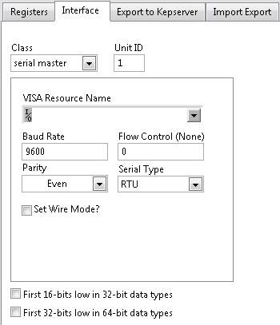

# Overview

Read or write values using Modbus Serial RTU, Serial ASCII, or TCP as either a master or slave. The module is built on the [NI Modbus Library](https://forums.ni.com/t5/NI-Labs-Toolkits/LabVIEW-Modbus-API/ta-p/3524019).

# Configuration of the Modbus Module

The Modbus module you run in DCAF will be just one of multiple endpoints in your Modbus system. You need to make sure you understand the topology of your system and the configuration of your devices to properly use the Modbus module.

## Registers

Use the **+** button to add new channels, the **-** button to remove them, and the gear button to edit them. 

The **Optimize Mapping** button will set the starting address and range of modbus addresses for each channel in order to create a contiguous block of inputs, followed by a contiguous block of outputs. This can be useful when creating a Modbus slave.

When adding or editing a channel, you will be presented with the *Configure Channels* dialog:

**Access Type:** Whether this channel will be read from Modbus or written to the Modbus device

**Channel Name:** The name the DCAF will use to associate tags with this channel

**Modbus Bank:** The set of registers the channel will access. You can choose between *coils*, *discrete inputs*, *input registers*, and *holding registers*

**Address:** The offset from the modbus bank that the channel will read from

**Alias:** The exact address of the register on the modbus. This value will not be set by the operator, it will be determined by the *Modbus Bank*, *Address*, and *Type* selections

**Bit/Length:** For a string channel, the number of registers to read or write to. For a boolean channel reading or writing to an input or holding register, this indicates the offset of the bit in the particular register

**Type:** The data type of the register

**Tag:** The DCAF tag to map the channel to

## Interface

**Class:** The protocol of the modbus endpoint. Choose between *TCP Master*, *TCP Slave*, *Serial Master*, and *Serial Slave*

**Unit ID:** Used for intra-system routing purposes for some serial devices

All Modbus values are either stored as single boolean values or in discrete 16-bit registers. For data types larger than 16-bits, you can change the byte orer by selecting **First 16-bits low in 32-bit data types** or **First 32-bits low in 64-bit data types**

### TCP

**Address:** The IP Address of the modbus slave this system will communicate with. This option is not available when configuring a *TCP Slave*

**Port:** The port the Modbus slave is listening on

### Serial

Select the VISA resource of the serial port connected to the Modbus network and configure the serial port so that it has the same setting as the other serial endpoints.

**Note:** To see the VISA resource names and settings of your devices, you can find them in the *Devices and Interfaces* pane of NI Measurement and Automation Explorer. This is useful when configuring your application on a different system than the one it will run on.

## Export

**Export to KEPServer:** Export this configuration to a CSV file which can imported to KEPServer

# Classified Errors

Error Number | Description | Classification
--- | --- | ---
538193 | Modbus Exception: Response Transaction ID doesn't match Request. This usually occurs on network error. | Recoverable

# Using the Modbus Module

If you are using the Modbus module as a master, make sure that the modbus slaves are accessible otherwise you may encounter initialization errors. 

### Software Requirements

+   LabVIEW 2014 or later
+   NI Modbus Library 1.2.1.42 or later

### Limitations

+   Supports the IEEE Modbus standard. If your device does not strictly implement the IEEE standard you may need to modify the module to conform to your devices specifications.
